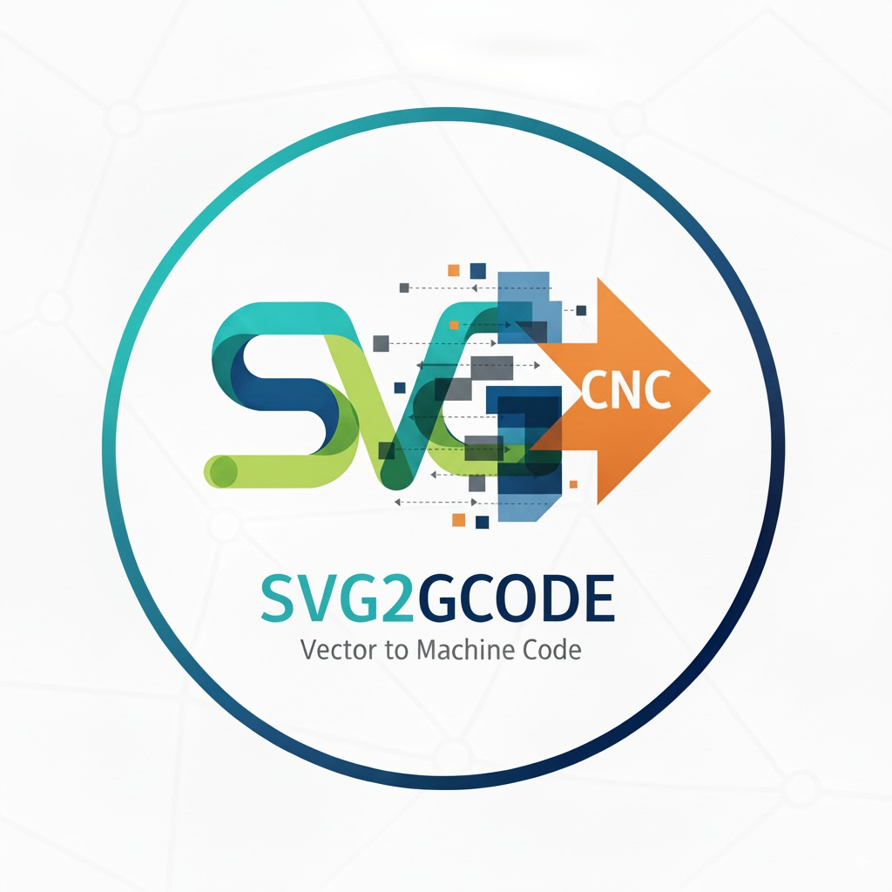

# toGcode

  

**🌐 [Launch toGcode](https://rickmcconney.github.io/toGcode/)**

Turn your designs into CNC-ready instructions, right in your browser. No complicated software to install or learn. Import your designs, set up your project, and export G-code for your CNC machine.

## Quick Start

1. **Open toGcode** - Just click the link above and start using it (no installation needed)
2. **Set up your wood** - Tell toGcode the size of your workpiece and the type of wood
3. **Add your design** - Import an SVG file, or draw your design directly
4. **Create toolpaths** - Choose what type of cut you want (profile, pocket, engraving, etc.)
5. **Export** - Save the G-code file for your CNC machine

That's it! Everything happens in your web browser.

## What You Can Do

- **Create from scratch** - Draw freehand, add shapes, or type text right in the browser
- **Use designs from other software** - Import SVG files from Adobe Illustrator, Inkscape, or other design programs
- **Try different materials** - Pre-loaded wood species help with cutting speeds and feeds
- **See what it will look like** - Watch a 3D preview of your CNC cutting the design before you run the machine
- **Manage your tools** - Keep track of your bits and their settings (diameter, speeds, feeds)
- **No software to buy** - Completely free, works in any modern web browser

### Creating Toolpaths
- **Profile Cuts** - Cut along the edges of your design (inside, outside or right on the line)
- **Pocket Cuts** - Remove material from a closed area (useful for inlays or large areas)
- **Drilling** - Create holes at specific locations
- **V-Carving** - Use V-bits for decorative engraving and detail work

### Your Tools & Materials
- **Tool Management** - Keep a library of your bits with their diameter and cutting speeds
- **Built-in Wood Species** - Choose from common woods (Oak, Maple, Pine, etc.) and toGcode automatically adjusts cutting speeds
- **Automatic Speed Calculation** - Let toGcode figure out the right speeds and feeds for your tool and wood

### Your Workpiece
- **Dimensions** - Tell toGcode how big your stock is (width, length, thickness)
- **Wood Type** - Select your material for optimized cutting parameters
- **Origin Point** - Choose where your design starts (corners, center, edges, etc.)

### Seeing What Will Happen
- **2D View** - See your design on your workpiece layout
- **3D Simulation** - Watch your CNC machine cut the design before running it on real wood
- **Zoom & Pan** - Zoom in to see details, use middle mouse button to pan around

## Getting Started

### Using toGcode Online (Easiest)

Just click here: **🌐 [Launch toGcode](https://rickmcconney.github.io/toGcode/)**

Open it in your web browser (Chrome, Firefox, Safari, or Edge). No installation needed.

### Step-by-Step Workflow

**Step 1: Set Up Your Workpiece**
- Click the "Workpiece" button in the left panel
- Enter your stock dimensions (width, length, thickness in millimeters)
- Choose the type of wood you're using
- Pick where your design should start (usually center)

**Step 2: Create or Import Your Design**
- **Import**: Click "Import SVG" to load a design from Adobe Illustrator, Inkscape, or other software
- **Draw**: Use the drawing tools (pen, shapes, text) to create directly in toGcode

**Step 3: Set Up Your Tools**
- Add your CNC bits with their diameter and cutting speeds in the tools tab

**Step 4: Create Toolpaths**
- Select your design on the canvas
- Choose the operation you want:
  - **Profile** - Cut around the edge
  - **Pocket** - Cut out a filled area
  - **Drill** - Make holes
  - **V-Carve** - Decorative engraving with a V-bit
- Adjust the depth and other settings in the panel on the right
- Watch the preview to see what will happen

**Step 5: Check Your Work**
- Look at the 3D tab to watch a simulation of your CNC cutting the design
- Use play/pause to slow it down or speed it up
- If something doesn't look right, go back and adjust

**Step 6: Export Your G-code**
- Click the export button
- Save the G-code file to your computer
- Load it into your CNC machine's controller

## Limitations

- Works best with modern web browsers (Chrome, Firefox, Safari, Edge)
- Very large or complex designs may slow down your browser
- Limited to flat 2.5D cuts (no full 3D machining)
- You may need to adjust the G-code settings for your specific CNC machine

## Notes for Users

**Feed Rate Limits**: toGcode caps automatic feed rate calculations at 1000 mm/min. If your machine can go faster, you can:
- Adjust the limit in the options
- You can also turn off automatic feed rate calculation and set speeds manually for each tool

**Your Data is Safe**: Everything runs in your browser. No files are uploaded anywhere. Your projects are saved locally on your computer.

## Contributing

This project welcomes contributions! Areas where help is especially needed:

### Development
- Feature implementations and enhancements
- Bug fixes and performance improvements
- Code refactoring and optimization
- Documentation improvements

### Testing
- Testing with various SVG files from different software
- Testing G-code output on different CNC machines, if you create a post processor profile I can add it to the default list.
- Cross-browser compatibility testing
- Performance testing with complex paths

### Feedback
- Bug reports with reproduction steps
- Feature requests with use case descriptions
- User experience feedback and suggestions
- Documentation gaps and unclear instructions

## Support

- **Issues**: Report bugs or request features via [GitHub Issues](https://github.com/rickmcconney/toGcode/issues)
- **Discussions**: Ask questions or share projects in [GitHub Discussions](https://github.com/rickmcconney/toGcode/discussions)

## License

This project is open source. Please check the repository for specific license terms.

---

*toGcode - Making CNC accessible for makers, woodworkers, and hobbyists*